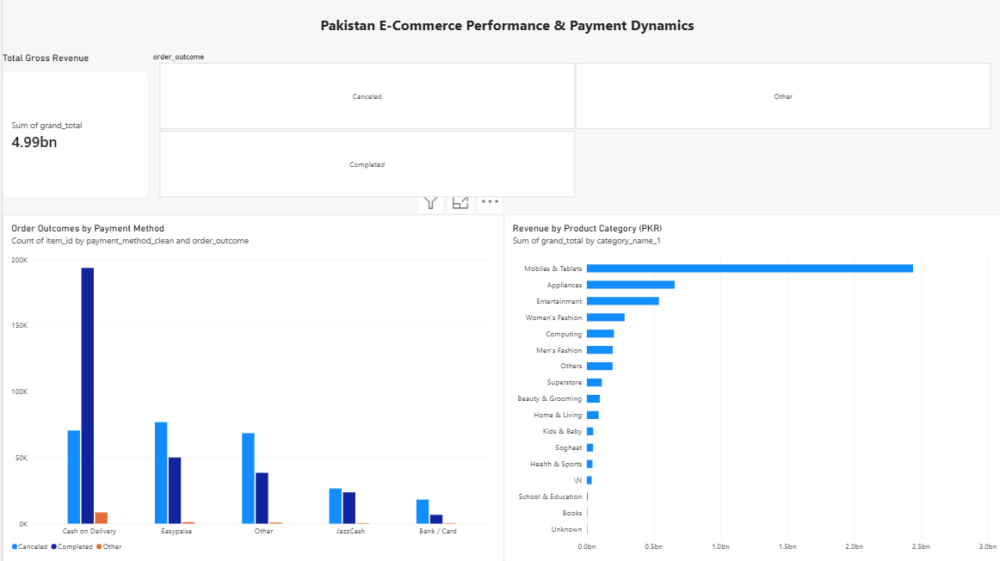
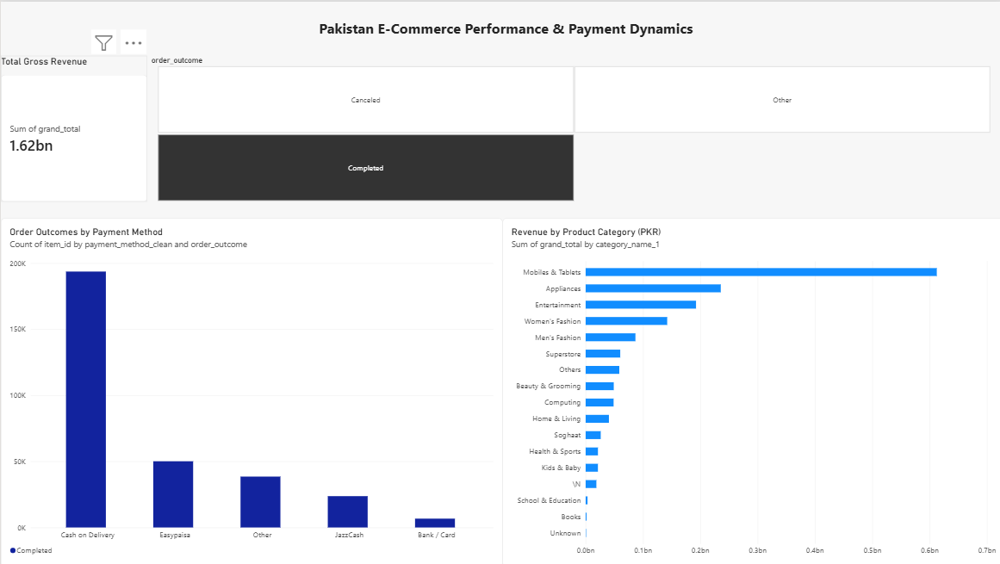
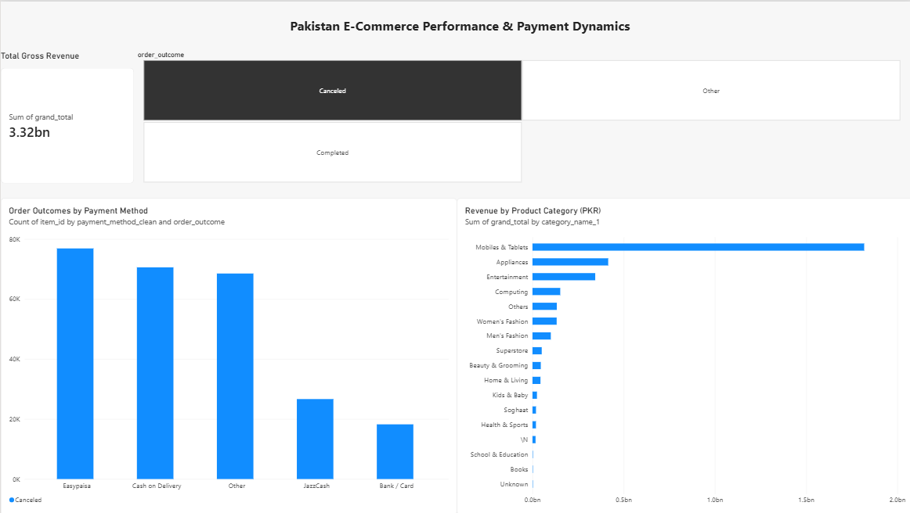

# 📊 Pakistan E-Commerce Market Analysis: Payment Friction & Customer Retention

An end-to-end data analytics project evaluating 500,000+ real transactions from Pakistan's largest e-commerce dataset. This project explores customer retention patterns, category revenue drivers, and the commercial realities of Cash on Delivery (COD) versus digital wallets.

---

## 🖥️ Interactive Dashboard Showcase

### 1. Overall Market & Payment Performance (Baseline)


### 2. Completed Orders Dynamic View


### 3. Canceled Orders Dynamic View (Checkout Friction)


---

## 🎯 Executive Summary & Core Insights

1. **The Digital Payment Friction Paradox:**
   - **Cash on Delivery (COD)** drove the platform's actual fulfillment with **264,187 orders** and a strong **73.3% completion rate**.
   - Digital payment gateways suffered severe drop-offs: **Bank / Card** transactions experienced a **73.2% cancellation rate**, while **Easypaisa** faced a **60.5% cancellation rate**.
   - *Business Takeaway:* In emerging markets, heavy COD usage is not merely customer reluctance—it is heavily reinforced by checkout friction, OTP delays, and payment gateway drop-offs on prepaid channels.

2. **The 50/50 Retention Threshold:**
   - Among customers with completed orders, **50.4% are repeat buyers (40,178)** and **49.6% are one-time buyers (39,597)**.
   - Half of all acquired customers churned after a single purchase. Converting an additional 5–10% of one-time buyers into repeat purchasers represents substantial revenue expansion with zero incremental customer acquisition cost (CAC).

3. **High-Ticket Category Dominance:**
   - **Mobiles & Tablets** drove overall business revenue, generating **PKR 612.4M (37.8% of platform gross revenue)** with an Average Order Value (AOV) of PKR 12,217.
   - **Men's Fashion** captured the highest transaction volume (52,652 completed orders) with a lower AOV of PKR 1,649.

---

## 🛠️ Tech Stack & Methodology

- **Data Processing & Exploration:** Python (`pandas`, `numpy`, `matplotlib`, `seaborn`) in Google Colab. Normalized inconsistent status codes, parsed transaction dates, and standardized fragmented payment strings.
- **Business Intelligence & Modeling:** Microsoft Power BI. Built DAX aggregations, interactive tile slicers, and relational visual cards for cross-filtering analysis.

---

## 💡 Strategic Business Recommendations

- **Fix Digital Payment Gateways:** Implement automated instant retry prompts and partner with local fintechs for 1-click checkout to recover the 60%+ digital payment drop-off.
- **Automated Re-engagement Funnel:** Trigger automated WhatsApp/SMS retention incentives for first-time buyers between days 30 and 45 post-delivery.
- **High-Ticket COD Verification:** Enforce automated IVR/call confirmation on Cash on Delivery orders above PKR 10,000 to prevent costly return-to-origin (RTO) courier fees.

---

## 📁 Repository Structure

```text
├── Pakistan_Ecommerce_Analysis.ipynb    # Python cleaning, EDA, and validation scripts
├── Pakistan_Ecommerce_Analysis.pbix     # Interactive Power BI dashboard report
├── 1_dashboard_full_view.png            # Baseline dashboard screenshot
├── 2_dashboard_completed_orders.png     # Filtered completed orders visual
├── 2_dashboard_canceled_orders.png      # Filtered cancellations visual
├── 2_dashboard_other_orders.png         # Filtered edge-case orders visual
└── README.md                            # Executive case study documentation
